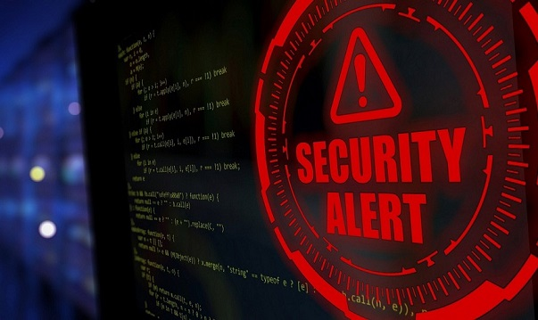

# Academic UoE Portfolio

---

## Launching into Cyber Security 

### Induction 
[Induction](/Induction.md)

### Discussion Summaries
[WhatsApp - data confidentially for data in transit](/Unit1.md)

[Network architecture as a defence – DMZ & Gateways](/Unit2.md)

### Threat Modelling
[UML Threat Modelling](/UML.md)

### Individual  Essay
[Essay - ASMIS Security evaluation](/essay.md)

### Codio Project
[En- and decryption of sensitve patient data](/Codio.md)

### Key learnings of Module 1 Launching into Cyber Security 
[Key learnings](/module1.md)

---
## Network and Information Security Management

### Discussion Summaries
[Medical IoT vunerabilities](/medical.md)

[Scanning results summary](/scanningsum.md)

[GDPR case summary](/GDPR.md)

[Debate arguments: Future Internet is based on p2p overlay networking](/debate.md)

### Vulnerability Scanning
[Basic scanning of Group 1](/scangroup.md)

[Scanning tools evaluation](/scantool.md)

[Design Document](/Designdoc.md)

[Executive Summary](exec/Exec.md)

### Key learnings of Module 2 Network and Information Security Management

[Key learnings](/module2.md)

---
## Information Risk Management

### Discussion Summaries
[User Participation in the Risk Management Process](/sample_page)

[The Effect of Risk on the SDLC](/sample_page)

### Risk Report
[Status Report](/sample_page)

[Risk Assesment Report](/sample_page)

## Research Methods and Professional Practice May 2023

### Formative Activities

[Reflective activity - Ethics in Computing](/Reflective activity - Ethics in Computing.md)

### Discussion Summaries
       

---
## Codio Projects 

[Project 1 Title](/sample_page)

          
---

## My CV  

- [German](/pdf/CV_Linhoff.pdf)
- [English](/pdf/CV_Linhoff.pdf)

---

---

